# Actions 流程图（workers-world/worker-actions）

本页是 Org 可复用 GitHub Actions 的 **可视化索引**：触发条件、job 依赖、跨 workflow 调用与 composite action 落点。文字规范仍以 [release-pr-ci.md](./release-pr-ci.md)、[actions-releases.md](./actions-releases.md) 为准；图内 **不写死** pin 版本号（当前推荐 tag 见 [manifest/actions-bundle.yaml](../manifest/actions-bundle.yaml)）。

## 目录

1. [总览与图例](#1-总览与图例)
2. [全局调用关系](#2-全局调用关系)
3. [Release PR 端到端](#3-release-pr-端到端)
4. [入口 workflow](#4-入口-workflow)
5. [Leaf workflow 详图](#5-leaf-workflow-详图)
6. [Bundle 发版链](#6-bundle-发版链)
7. [工具 / 验证](#7-工具--验证)
8. [Composite actions 矩阵](#8-composite-actions-矩阵)
9. [Workflow 速查表](#9-workflow-速查表)

---

## 1. 总览与图例

| 符号 / 约定 | 含义 |
|-------------|------|
| 实线箭头 `-->` | `uses:` 调用 reusable workflow，或 `needs` 依赖 |
| `|label|` | 事件或条件（如 `push dev_*`、`PR`、`workflow_run`） |
| 入口 | 可直接被业务仓 / 本仓 / dispatch 触发的 workflow |
| Leaf | 仅 `workflow_call`，由门面或其他 reusable 嵌套调用 |
| 节点 ID | camelCase；不用空格；避免 Mermaid 保留字（如 `end`） |

**两条主轨：**

| 轨 | 入口 | 用途 |
|----|------|------|
| Worker Release PR | `worker-ci.yml`（业务仓）/ `ci.yml`（本仓 dogfood） | `dev_*` → Release PR → 门禁 → auto-merge → `master` |
| Actions Bundle | `release-actions-bundle.yml` + `gh-release-on-tag.yml` | 打 `actions/vX.Y.Z` + GitHub Release 页；各业务仓手工 bump pin |

---

## 2. 全局调用关系

跨 workflow 的 `uses:` / `workflow_run` 边（不含业务仓薄 caller）。

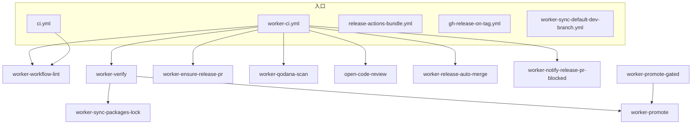

来源：[`.github/workflows/`](../.github/workflows/)（尤其 [`worker-ci.yml`](../.github/workflows/worker-ci.yml)、[`ci.yml`](../.github/workflows/ci.yml)）。

`worker-sync-default-dev-branch` 由业务仓 **独立** workflow 调用（与 `ci.yml` 无 `needs`）；verify 失败时仍可同步默认分支。

> 本仓 `ci.yml` 当前仅保留 fork-safe 的 `workflow-lint`（无 secrets）；Release PR / auto-merge / notify 链只在业务仓经 `worker-ci` 挂载。本仓发版（dev → master）由人工开 PR，见 [actions-releases.md](./actions-releases.md)。

---

## 3. Release PR 端到端

业务仓经 `worker-ci` 编排后的 push / PR 双轨（简化并行关系）。

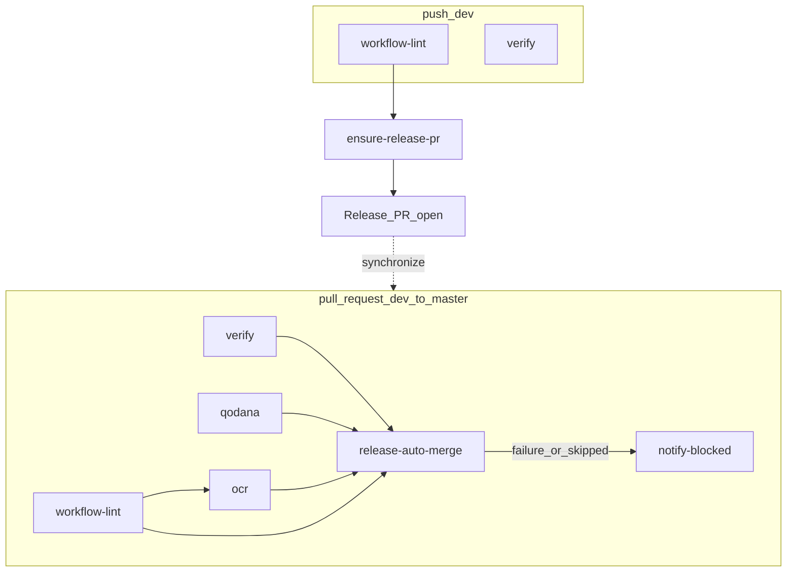

| 事件 | 运行的 job |
|------|------------|
| `push` → `dev_*` | workflow-lint → ensure-release-pr；verify（含可选 sync-lock）；另有独立 Sync default branch |
| `pull_request` → `master`（head=`dev_*`） | workflow-lint、verify、qodana、ocr → release-auto-merge；失败/绿门未合时 notify-blocked |

文字说明见 [release-pr-ci.md](./release-pr-ci.md)。

---

## 4. 入口 workflow

### 4.1 `worker-ci.yml`（业务仓门面）

唯一推荐入口：业务仓 `ci.yml` 只 `uses` 本文件，勿再展开 leaf。

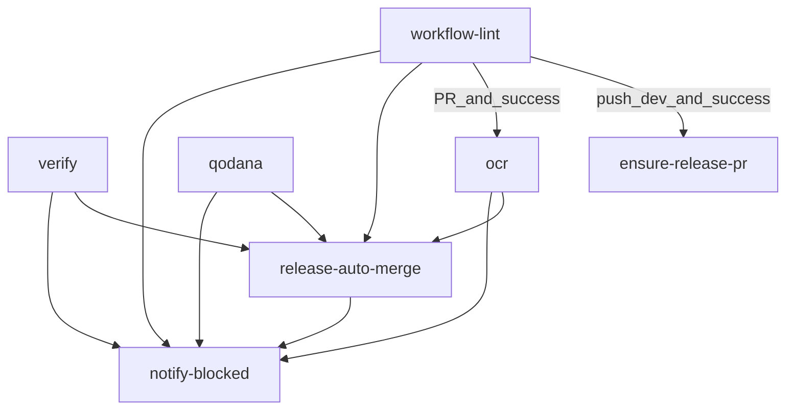

| Job | needs | 主要触发条件 |
|-----|-------|-------------|
| workflow-lint | — | push `dev_*` 或 Release PR |
| verify | — | 始终（由 nested worker-verify 按事件细分） |
| ensure-release-pr | workflow-lint | push `dev_*` 且 lint success；跳过 deleted |
| qodana | — | 同仓 Release PR（`dev_*` → `master`） |
| ocr | workflow-lint | 同上 + lint success；默认 `skip_ocr: true` |
| release-auto-merge | lint, verify, qodana, ocr | 四门全 success；可选非 draft |
| notify-blocked | 全部 | PR 且 merge 非 success（含四门绿但 merge skipped） |

来源：[`worker-ci.yml`](../.github/workflows/worker-ci.yml)。

### 4.2 `ci.yml`（本仓 dogfood）

本仓无应用代码，且 `ci.yml` 须对所有 PR（含 fork）安全：**仅**跑无 secrets 的 `workflow-lint`。Release PR / auto-merge / notify 链不在本仓挂载——本仓 `dev_*` → `master` 由人工开 PR（见 [actions-releases.md](./actions-releases.md)）。

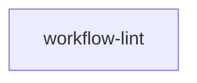

来源：[`ci.yml`](../.github/workflows/ci.yml)。合入 `master` 且改了 workflows/actions 后由 [Bundle 发版链](#6-bundle-发版链) 打 tag。

### 4.3 业务仓 caller 模板

推荐形态（与 `worker-ci` 注释一致）：单一 job `uses: …/worker-ci.yml@actions/vX.Y.Z`，`secrets: inherit`，`with` 只传仓间差异。

[`docs/templates/ci-release-pr.yml`](./templates/ci-release-pr.yml) 仍为 **展开 leaf** 的历史示例；新仓优先薄壳调 `worker-ci`，避免与门面双轨漂移。Sync default branch 须 **另建** 独立 workflow，勿并入 `ci.yml`。

---

## 5. Leaf workflow 详图

### 5.1 Verify 轨

#### `worker-verify.yml`

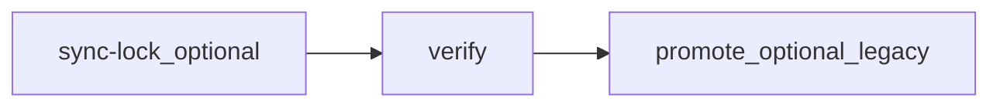

verify 步骤摘要：checkout（PR 用 **head SHA**，非 merge ref）→ 拉取 sync-lock 提交（push）→ PR 轮询等待 lock（可选）→ setup-node → 物化 SDK（可选）→ `npm ci` → `npm run check` → `npm test`（可选）。

| Job | 条件 |
|-----|------|
| sync-lock | `sync_packages_lock` + push `dev_*` → 调 `worker-sync-packages-lock` |
| verify | sync-lock success 或 skipped |
| promote | `promote: true` + push `dev_*` → 调 `worker-promote`（日常 Release PR 仓须 `false`） |

来源：[`worker-verify.yml`](../.github/workflows/worker-verify.yml)。

#### `worker-sync-packages-lock.yml`

来源：[`worker-sync-packages-lock.yml`](../.github/workflows/worker-sync-packages-lock.yml)。

### 5.2 门禁

#### `worker-workflow-lint.yml`

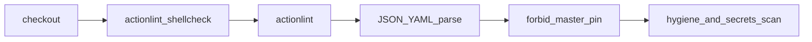

来源：[`worker-workflow-lint.yml`](../.github/workflows/worker-workflow-lint.yml)。

#### `worker-qodana-scan.yml`

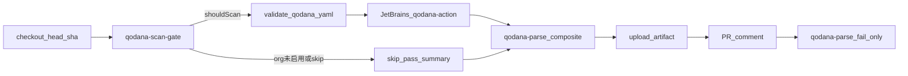

来源：[`worker-qodana-scan.yml`](../.github/workflows/worker-qodana-scan.yml)；说明见 [qodana-ci.md](./qodana-ci.md)。

#### `open-code-review.yml`

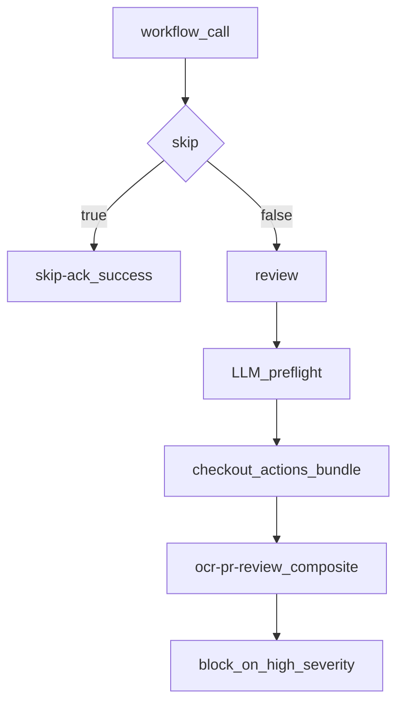

来源：[`open-code-review.yml`](../.github/workflows/open-code-review.yml)；说明见 [open-code-review.md](./open-code-review.md)。

### 5.3 Release PR 操作

#### `worker-ensure-release-pr.yml`

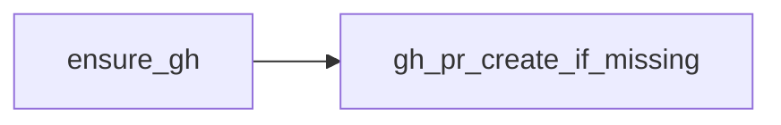

条件由 caller（`worker-ci` / `ci.yml`）限制为 push `dev_*`。来源：[`worker-ensure-release-pr.yml`](../.github/workflows/worker-ensure-release-pr.yml)。

#### `worker-release-auto-merge.yml`

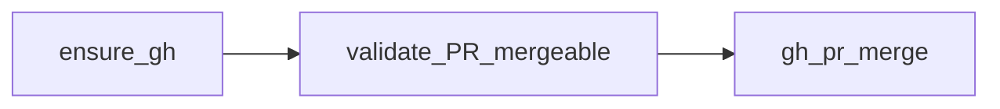

来源：[`worker-release-auto-merge.yml`](../.github/workflows/worker-release-auto-merge.yml)。

#### `worker-notify-release-pr-blocked.yml`

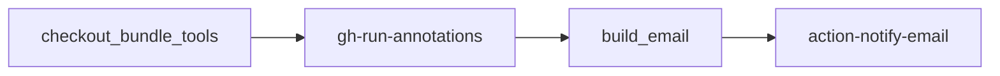

来源：[`worker-notify-release-pr-blocked.yml`](../.github/workflows/worker-notify-release-pr-blocked.yml)。

### 5.4 默认分支

#### `worker-sync-default-dev-branch.yml`

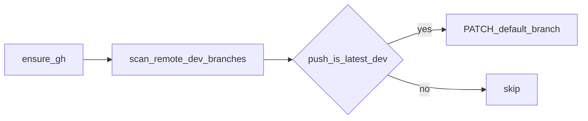

业务仓独立挂载；本仓（`.github`）保持 `master` 为默认分支。来源：[`worker-sync-default-dev-branch.yml`](../.github/workflows/worker-sync-default-dev-branch.yml)。

### 5.5 遗留 promote

日常业务仓走 `worker-ci`，勿与 OCR 门禁抢跑。

#### `worker-promote.yml`

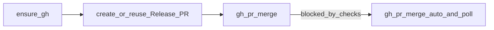

来源：[`worker-promote.yml`](../.github/workflows/worker-promote.yml)。

#### `worker-promote-gated.yml`

来源：[`worker-promote-gated.yml`](../.github/workflows/worker-promote-gated.yml)。

---

## 6. Bundle 发版链

方案 B：**tag 先存在，再在各业务仓手工 bump pin**。详见 [actions-releases.md](./actions-releases.md)。

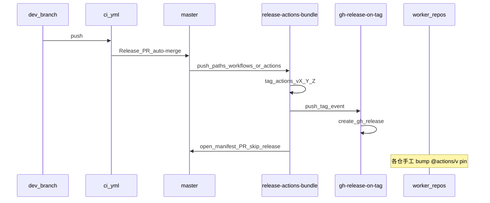

### `gh-release-on-tag.yml`

`push` → `actions/v*` tag 时调用 [`create-gh-release.yml`](../.github/workflows/create-gh-release.yml)（同仓 dogfood）。与 `release-actions-bundle` 解耦。详见 [gh-release.md](./gh-release.md)。

### `release-actions-bundle.yml`

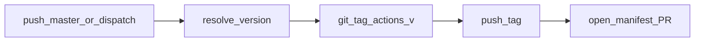

触发：`push` → `master` 且 paths 含 `.github/workflows/**` 或 `.github/actions/**`；或 `workflow_dispatch`（可指定 `version`）。commit message 含 `[skip actions-release]` 时跳过。

来源：[`release-actions-bundle.yml`](../.github/workflows/release-actions-bundle.yml)。

---

## 7. 工具 / 验证

本仓 `ci.yml` 对 **所有 PR（含 fork）** 跑 [`worker-workflow-lint.yml`](../.github/workflows/worker-workflow-lint.yml)（无 secrets）。Java Maven reusable workflow 在独立仓 [workers-world/java-actions](https://github.com/workers-world/java-actions)。

---

## 8. Composite actions 矩阵

路径：[`.github/actions/`](../.github/actions/)。

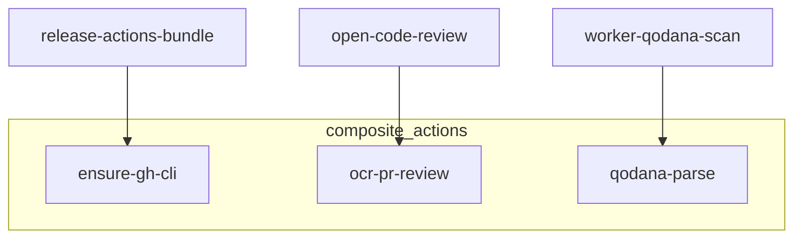

| Composite | 被谁调用 |
|-----------|----------|
| `ensure-gh-cli` | `release-actions-bundle`（部分 leaf 内联安装 gh，未必走此 action） |
| `ocr-pr-review` | `open-code-review` |
| `qodana-parse` | `worker-qodana-scan` |
| `qodana-scan-gate` | `worker-qodana-scan` |

跨仓 reusable 嵌套的 **workflow 与 composite** 均须全路径 `@actions/vX.Y.Z`（`$`/`./` 会解析到 caller 业务仓）；仅同仓 smoke 或先 checkout bundle 后可用相对路径（见 [actions-releases.md](./actions-releases.md)）。

---

## 9. Workflow 速查表

| Workflow | 触发 | 类型 | 上游 | 下游 |
|----------|------|------|------|------|
| `ci.yml` | push `dev_*`；PR → `master`（含 fork） | 本仓入口 | — | workflow-lint（无 secrets；fork-safe） |
| `worker-ci.yml` | `workflow_call` | 业务仓门面 | 业务仓 `ci.yml` | lint, verify, ensure-pr, qodana, OCR, ci-failure-comment, auto-merge, notify |
| `worker-workflow-lint.yml` | `workflow_call` | Leaf | worker-ci / ci | —（actionlint / manifest 格式 / 卫生 / 凭据扫描） |
| `worker-verify.yml` | `workflow_call` | Leaf | worker-ci | sync-packages-lock, promote |
| `worker-sync-packages-lock.yml` | `workflow_call` | Leaf | worker-verify | — |
| `worker-ensure-release-pr.yml` | `workflow_call` | Leaf | worker-ci / ci | — |
| `worker-qodana-scan.yml` | `workflow_call` | Leaf | worker-ci | composite `qodana-parse`, `qodana-scan-gate` |
| `open-code-review.yml` | `workflow_call` | Leaf | worker-ci / ci | composite `ocr-pr-review`；`review_mode` log\|comment |
| `worker-ci-failure-comment.yml` | `workflow_call` | Leaf | worker-ci | PR 门禁失败摘要评论 |
| `worker-outdated-pr-check.yml` | `workflow_call` | Leaf | 业务仓自建 trigger | Outdated PR Check status（72h） |
| `worker-outdated-pr-refresh.yml` | `workflow_call` | Leaf | 业务仓自建 cron | 刷新 outdated status |
| `worker-release-auto-merge.yml` | `workflow_call` | Leaf | worker-ci / ci | — |
| `worker-notify-release-pr-blocked.yml` | `workflow_call` | Leaf | worker-ci / ci | action-notify-email |
| `worker-sync-default-dev-branch.yml` | `workflow_call` | Leaf | 业务仓独立 workflow | — |
| `worker-promote.yml` | `workflow_call` | Leaf / legacy | worker-verify, promote-gated | — |
| `worker-promote-gated.yml` | `workflow_call` | Leaf / legacy | 遗留 caller | worker-promote |
| `release-actions-bundle.yml` | push `master`（paths）；dispatch | 本仓发版 | — | tag + manifest PR |
| `gh-release-on-tag.yml` | push `actions/v*` | 本仓入口 | tag push | create-gh-release |
| `create-gh-release.yml` | `workflow_call` | Leaf（跨仓通用） | gh-release-on-tag / 业务仓 caller | softprops Release |

内层嵌套 pin 与外层入口 pin 须同版本；勿长期「外层已升、内层仍旧」。权威 tag 见 [manifest/actions-bundle.yaml](../manifest/actions-bundle.yaml)。

## 相关

- [release-pr-ci.md](./release-pr-ci.md) — Release PR 模型与前置 Secret
- [actions-releases.md](./actions-releases.md) — Bundle tag / bump 消费者
- [gh-release.md](./gh-release.md) — GitHub Release 页面（跨仓 `create-gh-release`）
- [open-code-review.md](./open-code-review.md) — OCR
- [qodana-ci.md](./qodana-ci.md) — Qodana
- Java Maven CI：独立仓 [workers-world/java-actions](https://github.com/workers-world/java-actions)
