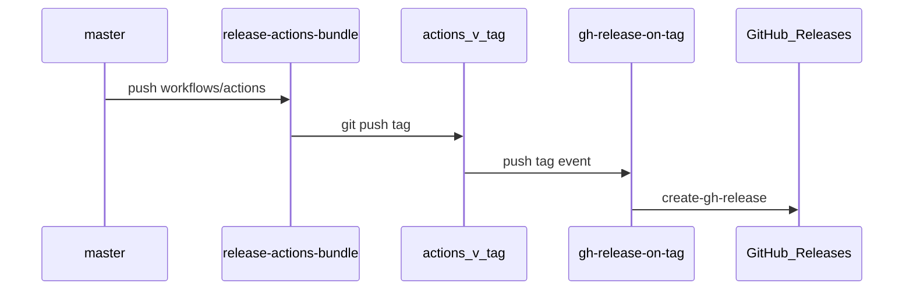

# GitHub Release（跨仓通用）

在 **git tag 已存在** 的前提下，建或更新 GitHub Releases 页面。与「打 tag」「部署」解耦。

| 层 | 文件 | 职责 |
|----|------|------|
| **Leaf** | [`.github/workflows/create-gh-release.yml`](../.github/workflows/create-gh-release.yml) | `workflow_call`；`softprops/action-gh-release@v2` + `generate_release_notes` |
| **Caller** | 各仓 `gh-release-on-tag.yml` | `on.push.tags` 过滤 + 传 `tag_name` |

**不采用** [semantic-release](https://semantic-release.gitbook.io/)：与 `dev_* → Release PR → master` 及 `actions/v*` bundle 发版链重复；见 [actions-releases.md](./actions-releases.md)。

## 引用矩阵

| 仓类型 | 示例 | Caller `on.push.tags` | `uses` |
|--------|------|----------------------|--------|
| Actions bundle（本仓） | worker-actions | `actions/v*` | `./.github/workflows/create-gh-release.yml`（同仓 dogfood） |
| Actions bundle（Java） | java-actions | `actions/v*` | `workers-world/worker-actions/.../create-gh-release.yml@actions/vX.Y.Z` |
| 业务 Worker | counter-worker | `v*` | 同上（跨仓 pin） |
| 个人/工具仓 | dotfiles, HexoBlogSources | `v*` | 同上（worker-actions **Public**） |

模板（复制到消费仓）：

- [`templates/gh-release-on-tag-v.yml`](../templates/gh-release-on-tag-v.yml) — `v*`
- [`templates/gh-release-on-tag-actions.yml`](../templates/gh-release-on-tag-actions.yml) — `actions/v*`

合入含 `create-gh-release` 的 bundle 后，将模板中的 `@actions/v0.1.0` bump 到实际打出 tag。

## Caller 契约

```yaml
name: Create GitHub Release
on:
  push:
    tags: ["v*"]   # bundle 仓用 actions/v*
permissions:
  contents: write
jobs:
  release:
    uses: workers-world/worker-actions/.github/workflows/create-gh-release.yml@actions/v0.1.0
    secrets: inherit
    with:
      tag_name: ${{ github.ref_name }}
```

**Secrets**

| 场景 | 推荐 |
|------|------|
| `workers-world/*` | Org `GHA_TOKEN`（`secrets: inherit`）或 `GITHUB_TOKEN` |
| 个人仓 | `GITHUB_TOKEN`（caller 须 `permissions: contents: write`） |

**跨仓前提**：worker-actions 保持 Public；消费仓允许使用 public reusable workflows。

## Leaf inputs

| input | 默认 | 说明 |
|-------|------|------|
| `tag_name` | （必填） | 如 `v1.2.0` 或 `actions/v0.1.1` |
| `release_name` | `Release {tag_name}` | Release 标题 |
| `generate_release_notes` | `true` | GitHub 自动生成 notes（含 PR 链接） |
| `body` | 空 | 非空时覆盖 auto notes |
| `draft` / `prerelease` | `false` | 草稿 / 预发布 |

同一 tag 重跑 → softprops **update** 已有 Release（幂等）。

## 发版链（bundle 仓）



`release-actions-bundle` **只打 tag**；`gh-release-on-tag` 监听 tag push 建 Release 页。manifest PR（`[skip actions-release]`）不会二次打 tag。

## tag 从哪来

| 仓 | 打 tag 方式 |
|----|-------------|
| worker-actions / java-actions | `release-actions-bundle` 自动 `actions/v*` |
| 业务 / 个人仓 | 手工或脚本，例如 `git tag v1.0.0 && git push origin v1.0.0` |

Caller **不会**自动打 tag；只负责「有 tag 时建 Release」。

## 外部仓迁移

### dotfiles

删除本地 `.github/workflows/release.yml` 中的 `prev_tag` / `git log` / `create-release@v1` 逻辑，替换为从 [`templates/gh-release-on-tag-v.yml`](../templates/gh-release-on-tag-v.yml) 复制的 `gh-release-on-tag.yml`。

### HexoBlogSources

同上；**保留** `hugo_deploy.yml`（`push master` → 部署）与 `gh-release-on-tag.yml`（`push v*` → Release 页）分层。

## 与旧 release.yml 对比

| 项 | dotfiles / HexoBlogSources 旧版 | `create-gh-release` |
|----|--------------------------------|---------------------|
| Changelog | `grep -A1` + `git log` | `generate_release_notes` |
| Action | Hexo 用已废弃 `create-release@v1` | `softprops/action-gh-release@v2` |
| 跨仓复用 | 每仓复制 | 单 leaf + pin tag |

## 相关

- [actions-releases.md](./actions-releases.md) — bundle tag 与 pin bump
- [actions-workflows.md §6](./actions-workflows.md#6-bundle-发版链)
