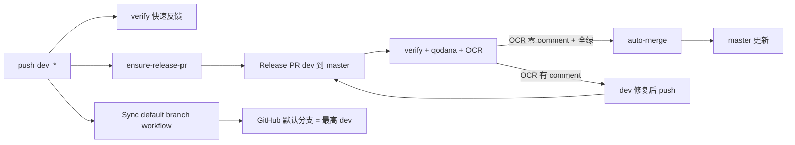

# Release PR 发布模型（dev_* → master）

替代 **push 绿则 FF master**：日常仍 push 到 `dev_*`，由 bot 维护 **Release PR**，门禁全绿后 **自动 merge**，正常无需人工。

完整流程图（含 `worker-ci` job 依赖、leaf 步骤、全局调用关系）见 [actions-workflows.md](./actions-workflows.md)（尤其 §3 / §4）。

## 流程



| 事件 | 运行的 job |
|------|------------|
| `push` → `dev_*` | **workflow-lint**（actionlint，先于建 PR）→ `ensure-release-pr`；业务仓另有 verify；**Sync default branch** |
| `pull_request` → `master`（head=`dev_*`） | **workflow-lint** → verify / qodana / **OCR**（lint 失败则不调 LLM）→ auto-merge；失败时 notify-blocked |

### Runner 调度（self-hosted）

Leaf workflow 的 `runs-on` 由 Org Variable **`GHA_RUNNER`** 控制（空则 `ubuntu-latest`）。详见 [self-hosted-runner.md](./self-hosted-runner.md)。

## Org 可复用 workflow

| Workflow | 作用 |
|----------|------|
| [worker-ci.yml](../.github/workflows/worker-ci.yml) | **业务仓 CI 门面**（唯一入口；`ci.yml` 只调这一次；内嵌下列 leaf） |
| [worker-ensure-release-pr.yml](../.github/workflows/worker-ensure-release-pr.yml) | push dev 时创建 Release PR（pin `@actions/vX.Y.Z`，见 [actions-releases.md](./actions-releases.md)） |
| [worker-release-auto-merge.yml](../.github/workflows/worker-release-auto-merge.yml) | 门禁通过后 merge PR（OCR 零 comment） |
| [open-code-review.yml](../.github/workflows/open-code-review.yml) | OCR（DeepSeek）；默认有 comment 则 fail |
| [worker-notify-release-pr-blocked.yml](../.github/workflows/worker-notify-release-pr-blocked.yml) | 未能 auto-merge 时邮件通知（`action-notify-email`） |
| [worker-sync-default-dev-branch.yml](../.github/workflows/worker-sync-default-dev-branch.yml) | push 最高 `dev_*` 时将 GitHub 默认分支设为该 dev（主分支 = 开发中） |

legacy：[worker-promote.yml](../.github/workflows/worker-promote.yml) / [worker-promote-gated.yml](../.github/workflows/worker-promote-gated.yml) — **已改为开 Release PR + `gh pr merge`**（禁止直推 master）；日常业务仓仍应走 `worker-ci`，勿再单独挂 promote。

## 默认分支策略（主分支 = 开发中）

各 **Worker 业务仓** GitHub **Default branch** = 数值最高的 `dev_XX_YY_ZZ`（纯数字三段，不含 `dev_00_02_00_touch_id` 等后缀轨）。`master` 仍为 Release PR base 与 CF Builds 发布轨，**不必**是默认分支。

| 分支 | 角色 | 是否默认 |
|------|------|----------|
| 最高 `dev_*` | 日常开发、clone 展示 | **是** |
| `master` | Release PR base、CF Builds | 否 |
| `workers-world/worker-actions` | 可复用 workflow 源 | **保持 `master` 默认** |

`sync-default-branch` 使用 **独立 workflow** [templates/sync-default-branch.yml](../templates/sync-default-branch.yml)，与 `ci.yml` 无 `needs` 依赖——verify 失败时仍会同步默认分支。workflow 与 sync job 均设 `permissions: {}`（**勿** `contents: write`）：改默认分支仅走 PAT `gh api`；`ensure-release-pr` / `release-auto-merge` 同理（建 PR / merge 仅走 PAT）；caller/callee 权限取交集，空集即禁用 GITHUB_TOKEN。push 到**当前最高** dev 时自动 PATCH；push 旧 dev 会 skip。人工开 PR 时注意 base 选 `master`——Release PR 仍由 `ensure-release-pr` 自动创建。

**运维**：默认已是 dev 时，删/重建 `master` 无需先在 Settings 改默认分支。

## 前置条件（必配）

### 1. Org Secret `GHA_TOKEN`

创建/merge Release PR **不能**依赖默认 `GITHUB_TOKEN`（多数 Org 开启「禁止 Actions 创建/批准 PR」）。

| 项 | 要求 |
|----|------|
| 类型 | classic PAT |
| 权限 | `repo`（含 PR 读写）+ `read:packages`（npm 拉 SDK） |
| 配置位置 | GitHub Org **workers-world** → Secrets → `GHA_TOKEN` |
| Caller | `secrets: inherit`（与 worker-verify 相同） |

> 旧名 `GH_DEPS_TOKEN` 已废弃；Org 中请改名或新建同名 Secret（PAT 值不变）。

与 [worker-verify 403 排查](../README.md) 用的是**同一个** Secret。

### 2. Org：阻断邮件（`NOTIFY_*`）

`notify-blocked` 经 `action-notify-email` 调通知 HTTP API（可选）。PR 信息与 job 结果由 caller 传入。caller job 须授予 **只读** 权限以拉取 Annotations：

```yaml
permissions:
  actions: read
  checks: read
  contents: read
```

Org 须已配置：

| 名称 | 类型 | 用途 |
|------|------|------|
| `NOTIFY_WORKER_URL` | Org **Variable** | notify-worker 公网根 URL（非密钥） |
| `NOTIFY_GHA_TOKEN` | Org **Secret** | 与 notify-worker `NOTIFY_GHA_TOKEN` wrangler secret **同值** |

Caller `secrets: inherit`（**仅**传 `NOTIFY_GHA_TOKEN`；**勿**再显式 `secrets: NOTIFY_WORKER_URL`，called workflow 已不声明该 secret，否则会 `invalid workflow file`）。URL 经 `vars.NOTIFY_WORKER_URL` 读取。未传 `to` 时收件人为 notify-worker `DEFAULT_TO`。

- **配置缺失**（Variable/Secret 空）：`Guard notify channel config` 步骤 **fail** job，避免通道静默失效。
- **发信瞬时失败**：`fail-on-error: false`，不因网络/worker 抖动把阻断通知 job 染红。

### 3. （可选）仓库 Actions 设置

若坚持用 `GITHUB_TOKEN` 而非 PAT，须在**各业务仓**：

**Settings → Actions → General → Workflow permissions** → 勾选 **Allow GitHub Actions to create and approve pull requests**

Org 级仍可能覆盖禁止；**推荐始终使用 `GHA_TOKEN`**。

## 业务仓 `ci.yml` 模板（薄 caller）

见 [templates/ci-release-pr.yml](../templates/ci-release-pr.yml)。试点：counter-worker。业务仓 **只** `uses: worker-ci.yml@actions/vX.Y.Z`（当前见 [manifest/actions-bundle.yaml](../manifest/actions-bundle.yaml)），**禁止** `@master`，**不要**在仓内再展开 6 个 leaf job。

要点：

1. `pull_request.branches: [master]`；`concurrency` 取消旧 run
2. 单一 job `release-pr`：permissions 取并集（`contents`/`packages`/`pull-requests`/`issues`），`secrets: inherit`
3. `with` 只传仓间差异（`materialize_sdk` / `run_tests` / `sync_packages_lock` 等）；SDK 版本以 `package.json` 为准；默认 `promote: false`
4. 编排内已含 OCR + notify-blocked；勿单独对 `dev_*` 开 OCR workflow
5. 另复制 [templates/sync-default-branch.yml](../templates/sync-default-branch.yml) 为独立 workflow（**勿**并入编排 / `ci.yml`）
6. 特殊仓：`skip_branch_deleted_check` / `require_non_draft_pr`（如 deploy-tracker）。**OCR 默认 `skip_ocr: true`（临时）**；版本收尾要审查时传 `skip_ocr: false`

**Secret 传递**：入口层（业务仓 → `worker-ci`）`secrets: inherit`；`worker-ci` 内部对每个 leaf **显式映射最小集**（zizmor `secrets-inherit` 要求，勿在 leaf 层恢复 inherit）：verify / ensure-release-pr / auto-merge / promote → `GHA_TOKEN`；qodana → `QODANA_TOKEN`（Org 未配置为空，gate 自动 skip）；ocr → `OCR_LLM_TOKEN` / `DEEPSEEK_API_KEY`（旧名兼容）/ `OCR_LLM_*` / `GHA_TOKEN`；notify-blocked → `NOTIFY_GHA_TOKEN` / `GHA_TOKEN`；workflow-lint / ci-failure-comment 不需要任何 secret。

**package-lock 与 sync-lock**：`sync_packages_lock: true` 时，push `dev_*` 由 bot 按 `package.json` 刷新 lock；PR verify checkout **head SHA**（非 `pull/N/merge`），并在 lock 未就绪时短轮询等待 bot（避免与 push workflow 并行竞态）。`materialize_sdk: false`（无 SDK）的仓不跑 wait。bump SDK 只改 `package.json` 即可，无需手改 lock。

## 阻断通知

**何时发信**：`pull_request` 跑完且 `release-auto-merge` **未** success（verify / qodana / OCR 失败，或门禁绿但 merge 失败）。**不**在 PR 刚创建、门禁尚在跑时通知。

邮件含：仓库、PR 链接、Actions run、各 job result、原因摘要，以及本 run **Annotations 面板**中的 ERROR / WARNING / NOTICE（`tools/gh-run-annotations.mjs` 经 GitHub Checks API 拉取）。同一 PR 每次失败 run 各一封（`dedup-key` 含 `run_id`）。

正文同时发 **纯文本 + HTML**：PR / Actions run 为可点击 `<a href>`（由 `tools/build-release-pr-blocked-email.mjs` 生成）。若 `actions_bundle_ref` 尚未包含该脚本，则退回纯文本；此时依赖 **notify-worker** 对仅-body 邮件的 auto-linkify 兜底，仍可将 `https://…` 转为可点链接。

## 分支保护（推荐）

在 GitHub 仓库 **Settings → Branches → master**：

- Require pull request before merging（可仅 bot merge）
- 可选 Required checks：`verify`、`qodana`、`ocr` / `review`

即使未开 branch protection，workflow 内 `release-auto-merge` 仍会在同 run 内 merge；protection 防止误直推 master。

## 与 OCR

**临时策略（当前）**：`worker-ci` 默认 `skip_ocr: true`（本仓 dogfood `ci.yml` 亦 `skip: true`），不调 LLM；verify / qodana / auto-merge 照常。目标「一版本结尾 OCR 一次」待设计后再默认开启。

OCR 启用时必须在 **Release PR** 上运行（`pull_request` → `master`）。仅 push dev 不会跑 OCR。

**auto-merge 条件（OCR 开启时）**：`open-code-review` 默认 `block_merge_on_comments: true`——OCR 回帖 **≥1 条** 行内审查意见时 **ocr job fail**，`release-auto-merge` 不执行，PR **保持 OPEN**，可在 GitHub 上 Apply suggestion 或在 dev 修复后 push 重跑。零 comment 且 verify + qodana 全绿才 auto-merge。OCR fail 时同 run 的 **`notify-blocked` 会发邮件**。若门禁全绿但 `release-auto-merge` 为 `skipped`（如 draft + `require_non_draft_pr`），**同样触发** `notify-blocked`，避免 PR 静默卡住。

修复循环（OCR 开启时）：`dev 改代码 → push → PR 更新 → OCR 重跑 → 零 comment → merge`。

## 与 Qodana（成本策略）

**Org opt-in（`actions/v0.4.36+`）**：须 Org Variable `QODANA_ENABLED` = `true`/`1`/`yes` 才进入下方路径/限频逻辑；未设置则全组织 skip（job 仍 success）。详见 [qodana-ci.md](./qodana-ci.md) §Org 级开关。

**默认策略（`actions/v0.4.32+`）**：`worker-qodana-scan` 在 job **内部**短路，**不用** `skipped`（branch protection / auto-merge 仍要求 `qodana` job **success**）。

| 条件 | 行为 |
|------|------|
| Org 未启用 Qodana | job **success**，不调 Docker，PR 评论注明 Org Variable skip |
| PR diff 无业务代码路径（docs/lock/纯 CI 等） | job **success**，不调 Docker，PR 评论注明 skip |
| 同一 PR 距上次全量扫描 &lt; 30min（`synchronize`） | 同上，限频复用 |
| `opened` / `reopened` / `ready_for_review` | 有代码变更则全量扫描 |
| Qodana 返回 Nothing to analyse | **success**（增量无可分析文件） |

可调：`worker-ci` inputs `qodana_throttle_minutes`（`0`=禁用限频）、`qodana_code_paths`（覆盖默认 glob 列表）。详见 [qodana-ci.md](./qodana-ci.md)。

## 迁移自 push-promote

1. `ci.yml` 换模板，删除 `promote` job
2. `pull_request` 目标改为 `master`
3. 合并 standalone `ocr-review.yml` 进 `ci.yml`（若存在）
4. 首次 push dev 后会自动开 Release PR；观察 auto-merge

## 相关

- [actions-workflows.md](./actions-workflows.md)（全部 Actions 的 Mermaid 流程图）
- [actions-releases.md](./actions-releases.md)（方案 B：tag 先发布、自动 bump 消费者；**勿往发版中的 `dev_*` 合 master**）
- [qodana-ci.md](./qodana-ci.md)
- [open-code-review.md](./open-code-review.md)
