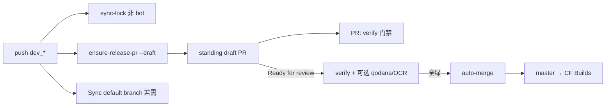

# Release PR 发布模型（dev_* → master）

日常 push 到 `dev_*`，由 bot 维护 **draft Release PR**；版本收尾 **Ready for review** 后门禁全绿才 **自动 merge** 到 `master`（触发 Cloudflare Builds）。

完整流程图（含 `worker-ci` job 依赖、leaf 步骤、全局调用关系）见 [actions-workflows.md](./actions-workflows.md)（尤其 §3 / §4）。

## 流程（`actions/v0.2.0+` 成本策略）



| 事件 | 运行的 job |
|------|------------|
| `push` → `dev_*`（非 bot） | `sync-lock`（若启用）；`ensure-release-pr`（默认 **draft**）；**Sync default branch**（仅当默认分支 ≠ 当前 ref） |
| `push` → `dev_*`（`github-actions[bot]`） | **全部跳过**（lock 提交会 synchronize 已有 draft PR） |
| `pull_request` → `master`（head=`dev_*`，仍 draft） | **verify**（唯一全量门禁）；`workflow-lint`；可选 qodana/OCR；**不** auto-merge |
| `ready_for_review` / 非 draft PR | 同上 + **auto-merge**（门禁绿） |

**不再**在每次 push 上跑 verify / workflow-lint / qodana / OCR（`verify_on_push: true` 可恢复旧快反馈）。

### Runner 调度（self-hosted）

Leaf workflow 的 `runs-on` 由 Org Variable **`GHA_RUNNER`** 控制（空则 `ubuntu-latest`）。详见 [self-hosted-runner.md](./self-hosted-runner.md)。

## Org 可复用 workflow

| Workflow | 作用 |
|----------|------|
| [worker-ci.yml](../.github/workflows/worker-ci.yml) | **业务仓 CI 门面**（唯一入口；`ci.yml` 只调这一次；内嵌下列 leaf） |
| [worker-ensure-release-pr.yml](../.github/workflows/worker-ensure-release-pr.yml) | push dev 时创建 **draft** Release PR（`create_draft_release_pr` 默认 true） |
| [worker-release-auto-merge.yml](../.github/workflows/worker-release-auto-merge.yml) | 非 draft + 门禁通过后 merge PR |
| [open-code-review.yml](../.github/workflows/open-code-review.yml) | OCR（DeepSeek）；`skip_ocr: true` 时门面 **不调用**（无空 runner） |
| [worker-notify-release-pr-blocked.yml](../.github/workflows/worker-notify-release-pr-blocked.yml) | 未能 auto-merge 时邮件通知（仅非 draft） |
| [worker-sync-default-dev-branch.yml](../.github/workflows/worker-sync-default-dev-branch.yml) | push 最高 `dev_*` 时将 GitHub 默认分支设为该 dev |

legacy：[worker-promote.yml](../.github/workflows/worker-promote.yml) / [worker-promote-gated.yml](../.github/workflows/worker-promote-gated.yml) — **已改为开 Release PR + `gh pr merge`**（禁止直推 master）；日常业务仓仍应走 `worker-ci`，勿再单独挂 promote。

## 默认分支策略（主分支 = 开发中）

各 **Worker 业务仓** GitHub **Default branch** = 数值最高的 `dev_XX_YY_ZZ`（纯数字三段，不含 `dev_00_02_00_touch_id` 等后缀轨）。`master` 仍为 Release PR base 与 CF Builds 发布轨，**不必**是默认分支。

| 分支 | 角色 | 是否默认 |
|------|------|----------|
| 最高 `dev_*` | 日常开发、clone 展示 | **是** |
| `master` | Release PR base、CF Builds | 否 |
| `workers-world/worker-actions` | 可复用 workflow 源 | **保持 `master` 默认** |

`sync-default-branch` 使用 **独立 workflow** [templates/sync-default-branch.yml](../templates/sync-default-branch.yml)，与 `ci.yml` 无 `needs` 依赖。caller 在 **默认分支已是当前 `dev_*`** 或 **lock-bot push** 时 **不起 runner**。

## 前置条件（必配）

### 1. Org Secret `GHA_TOKEN`

创建/merge Release PR **不能**依赖默认 `GITHUB_TOKEN`（多数 Org 开启「禁止 Actions 创建/批准 PR」）。

| 项 | 要求 |
|----|------|
| 类型 | classic PAT |
| 权限 | `repo`（含 PR 读写）+ `read:packages`（npm 拉 SDK） |
| 配置位置 | GitHub Org **workers-world** → Secrets → `GHA_TOKEN` |
| Caller | `secrets: inherit`（与 worker-verify 相同） |

> 旧名 `GH_DEPS_TOKEN` 已废弃；Org 中请改名或新建同名 Secret（PAT 值不变）。

与 [worker-verify 403 排查](../README.md) 用的是**同一个** Secret。

### 2. Org：阻断邮件（`NOTIFY_*`）

`notify-blocked` 经 `action-notify-email` 调通知 HTTP API（可选）。**仅非 draft PR** 发信。caller job 须授予 **只读** 权限以拉取 Annotations：

```yaml
permissions:
  actions: read
  checks: read
  contents: read
```

Org 须已配置：

| 名称 | 类型 | 用途 |
|------|------|------|
| `NOTIFY_WORKER_URL` | Org **Variable** | notify-worker 公网根 URL（非密钥） |
| `NOTIFY_GHA_TOKEN` | Org **Secret** | 与 notify-worker `NOTIFY_GHA_TOKEN` wrangler secret **同值** |

### 3. （可选）仓库 Actions 设置

若坚持用 `GITHUB_TOKEN` 而非 PAT，须在**各业务仓**：

**Settings → Actions → General → Workflow permissions** → 勾选 **Allow GitHub Actions to create and approve pull requests**

**推荐始终使用 `GHA_TOKEN`**。

## 业务仓 `ci.yml` 模板（薄 caller）

见 [templates/ci-release-pr.yml](../templates/ci-release-pr.yml)。业务仓 **只** `uses: worker-ci.yml@actions/vX.Y.Z`（当前见 [manifest/actions-bundle.yaml](../manifest/actions-bundle.yaml)），**禁止** `@master`。

要点：

1. `pull_request.branches: [master]`；建议 `paths-ignore: ["**/*.md", "docs/**"]`；`concurrency` 取消旧 run
2. 单一 job `release-pr`：permissions 取并集，`secrets: inherit`
3. `with` 只传仓间差异；默认 `promote: false`、`create_draft_release_pr: true`、`verify_on_push: false`、`skip_ocr: true`
4. 另复制 [templates/sync-default-branch.yml](../templates/sync-default-branch.yml) 为独立 workflow
5. 版本收尾：在 GitHub 上将 Release PR **Ready for review** → CI 绿 → auto-merge → Builds

**Secret 传递**：入口层 `secrets: inherit`；`worker-ci` 内部对每个 leaf **显式映射最小集**。

**package-lock 与 sync-lock**：`sync_packages_lock: true` 时，push `dev_*` 由 bot 按 `package.json` 刷新 lock；bot 自身 push **不**再跑 lint/verify/ensure/sync-default。

## 成本与空转 job（`v0.2.0`）

| Job | 何时启动 |
|-----|----------|
| workflow-lint | 仅 Release PR（非 bot） |
| verify（npm ci/check/test） | 仅 PR（或 `verify_on_push: true`） |
| sync-lock | push + 非 bot |
| ensure-release-pr | push + 非 bot |
| qodana | Org `QODANA_ENABLED` / `WORKERS_WORLD_QODANA_ENABLED` 为 true **且** PR；否则 **skipped**（auto-merge 接受 skipped） |
| ocr | `skip_ocr: false` 且 PR；否则 **不调用** workflow |
| sync-default | 默认分支 ≠ 当前 ref，且非 bot |
| ci-summary | 每次 run（估算 hosted job 数） |

## 阻断通知

**何时发信**：非 draft 的 `pull_request` 跑完且 `release-auto-merge` **未** success。draft 期间不发。

## 分支保护（推荐）

在 GitHub 仓库 **Settings → Branches → master**：

- Require pull request before merging（可仅 bot merge）
- 可选 Required checks：`verify`（qodana/ocr 常为 skipped，勿设为 required，除非 Org 已启用）

## 与 OCR

**默认**：`skip_ocr: true`，门面不调 `open-code-review`（无 skip-ack runner）。版本收尾传 `skip_ocr: false`。

OCR 启用时：`block_merge_on_comments: true` 时 high 意见 fail ocr → 不 merge。

## 与 Qodana（成本策略）

**`actions/v0.2.0+`**：Org 未启用时 **job 级不启动**（`skipped`）；`release-auto-merge` 将 `success` **或** `skipped` 视为通过。启用后路径过滤 / 30min 限频仍在 [worker-qodana-scan](./qodana-ci.md) 内部。

兼容：同时认 Org Variable `QODANA_ENABLED` 与 `WORKERS_WORLD_QODANA_ENABLED`。

## 迁移自 push-promote / 旧 ready 自动合

1. bump pin 到 `@actions/v0.2.0`（tag 须已存在）
2. 复制最新 `templates/ci-release-pr.yml` / `sync-default-branch.yml`
3. 既有 **ready** open Release PR：不会被强制改 draft；可手动 Convert to draft，或合完后由下次 ensure 建新 draft
4. 日常开发保持 draft；发版点 Ready

## 相关

- [actions-workflows.md](./actions-workflows.md)
- [actions-releases.md](./actions-releases.md)
- [qodana-ci.md](./qodana-ci.md)
- [open-code-review.md](./open-code-review.md)
